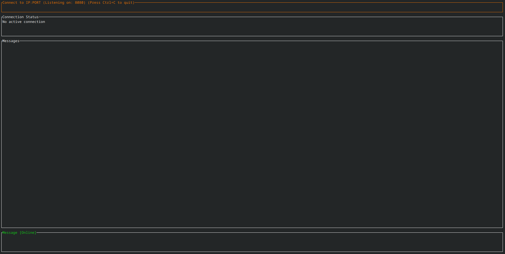

# P2P CLI




A terminal-based peer-to-peer messenger with hybrid encryption and persistent message history.

## Features

- Terminal user interface with real-time messaging
- Hybrid RSA/AES encryption for secure communication
- Persistent message history with SQLite
- Connection timeout handling and graceful disconnection
- Cross-platform support

## Usage

```bash
cargo run [-- --port <PORT>]
```

- Use Tab to navigate between fields
- Enter peer IP and press Enter to connect
- Accept/decline connections with 'a'/'d'
- Press Ctrl+C to quit

## Build

```bash
cargo build --release
```
