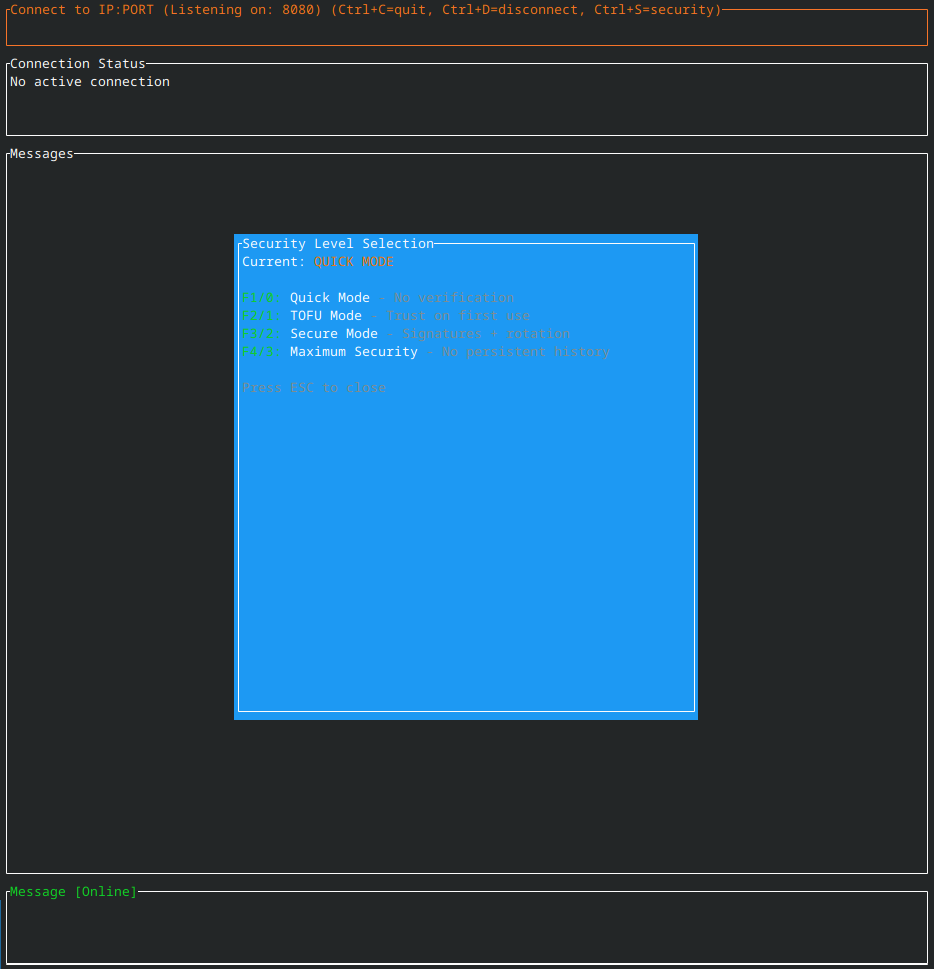

# P2P CLI


A modern, secure, terminal-based peer-to-peer messenger written in Rust. Features hybrid RSA/AES encryption, tiered security levels (Quick→Maximum), persistent encrypted message history, and a clean TUI interface. No servers, no middlemen—just direct, encrypted communication between peers.

> IMPORTANT: This project is under development and is not a stable, released product. It is provided "as-is", without warranty or guarantee. It works to some extent, but may be incomplete, unstable, or contain bugs. Mentions of a version such as "v2" do not imply an official release.




## Features

- **Hybrid RSA/AES Encryption** - Ephemeral session keys + AES-256-GCM for messages
- **TOFU Identity Verification** - Trust on First Use with Ed25519 identity keys
- **Four Security Levels** - From quick messaging to maximum security
- **Persistent Encrypted History** - SQLite storage with AES-256 encryption
- **Modern TUI** - Ratatui-based terminal interface with scrolling
- **Chat Commands** - `/help`, `/fingerprint`, `/alias`, and more
- **Message Scrolling** - PageUp/PageDown to browse history

## Installation

```bash
# Clone the repository
git clone https://github.com/KyleDerZweite/p2p-cli.git
cd p2p-cli

# Build and run
cargo build --release
./target/release/p2p-cli --help
```

## Usage

```bash
# Start with default settings (port 8080, quick mode)
p2p-cli

# Listen on a specific port
p2p-cli -p 9000

# Start with TOFU security (identity verification)
p2p-cli -s tofu

# Start with maximum security (no persistent history)
p2p-cli -s max

# Combine options
p2p-cli -p 9000 -s secure -v
```

## Security Levels

| Level | Name | Description |
|-------|------|-------------|
| 0 | **Quick** | No identity verification, encrypted messages |
| 1 | **TOFU** | Trust on First Use - identity keys & fingerprints |
| 2 | **Secure** | Signatures + key rotation (coming soon) |
| 3 | **Maximum** | No persistent history, memory-only messaging |

## Chat Commands

| Command | Description |
|---------|-------------|
| `/help`, `/h` | Show available commands |
| `/fingerprint`, `/fp` | Show identity fingerprints |
| `/alias <name>` | Set alias for current peer |
| `/trust` | Permanently trust current peer |
| `/clear` | Clear message history |
| `/disconnect`, `/dc` | Disconnect from peer |
| `/status` | Show connection status |

## Keyboard Shortcuts

| Key | Action |
|-----|--------|
| `Tab` | Switch between Connect/Message fields |
| `Enter` | Connect to peer / Send message |
| `Ctrl+C` | Quit application |
| `Ctrl+D` | Disconnect from peer |
| `Ctrl+S` | Open security level selection |
| `F1-F4` | Select security level (0-3) |
| `PageUp/Down` | Scroll messages |
| `Ctrl+Home/End` | Scroll to top/bottom |
| `a` | Accept incoming connection |
| `d` | Decline incoming connection |
| `o` | Accept once (don't permanently trust) |

## Security Architecture

### Encryption Layers

1. **Session Keys** (RSA-2048): Ephemeral keys generated per session for forward secrecy
2. **Message Encryption** (AES-256-GCM): All messages encrypted end-to-end
3. **Storage Encryption** (AES-256-GCM): Message history encrypted at rest
4. **Identity Keys** (Ed25519): Permanent keys for TOFU authentication

### TOFU (Trust on First Use)

When running in TOFU mode (`-s tofu`), the app:
1. Generates a permanent Ed25519 identity key pair (stored in `.p2p_identity`)
2. Signs session keys with the identity key
3. Displays peer fingerprints (e.g., `A1B2-C3D4-E5F6-G7H8`)
4. Warns if a known peer's identity key changes (potential MITM attack)

## Project Structure

```
src/
├── main.rs           # Entry point, CLI parsing
├── error.rs          # Custom error types
├── app/              # Application logic
│   ├── mod.rs        # App coordinator
│   ├── config.rs     # Configuration & security levels
│   └── state.rs      # Application state
├── crypto/           # Cryptography
│   ├── mod.rs        # Module exports
│   ├── session.rs    # Session encryption (RSA/AES)
│   └── identity.rs   # Identity keys (Ed25519)
├── network/          # Networking
│   ├── mod.rs        # Network manager
│   ├── messages.rs   # Protocol messages
│   └── connection.rs # TCP connection handling
├── ui/               # User interface
│   ├── mod.rs        # UI manager
│   ├── renderer.rs   # TUI rendering
│   ├── input.rs      # Input handling
│   └── terminal.rs   # Terminal management
└── messagedb.rs      # SQLite message storage
```

## Dependencies

- **tokio** - Async runtime
- **ratatui** - Terminal UI framework
- **rsa** - RSA encryption
- **ed25519-dalek** - Ed25519 signatures
- **aes-gcm** - AES-256-GCM encryption
- **rusqlite** - SQLite database
- **clap** - CLI argument parsing
- **thiserror** - Error handling

## Roadmap

- [x] Basic P2P messaging
- [x] Hybrid RSA/AES encryption
- [x] Persistent message history
- [x] Security level framework
- [x] TOFU identity verification
- [x] Chat commands
- [x] Message scrolling
- [ ] Key rotation (Level 2)
- [ ] File transfer
- [ ] Multi-peer connections
- [ ] NAT traversal
- [ ] mDNS peer discovery

## License

MIT License - see [LICENSE](LICENSE) for details.

## Contributing

Contributions are welcome! Please feel free to submit a Pull Request.
