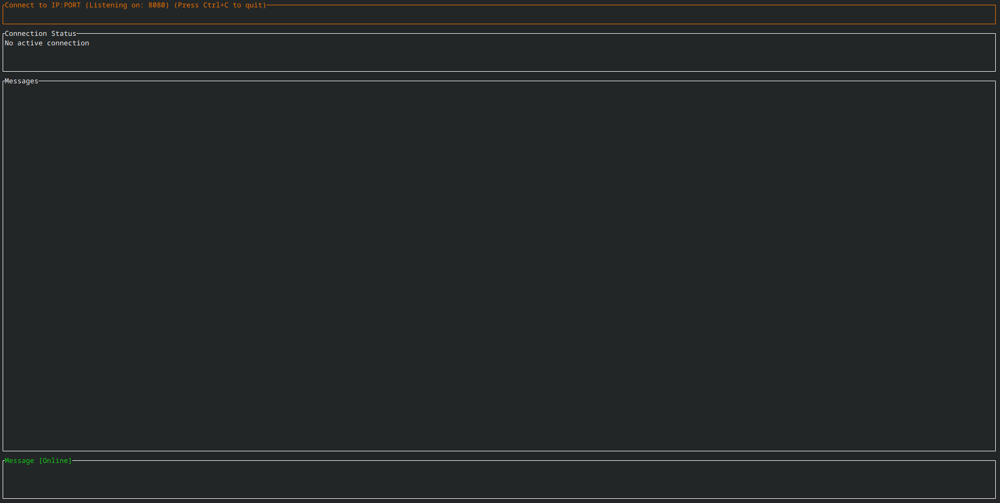
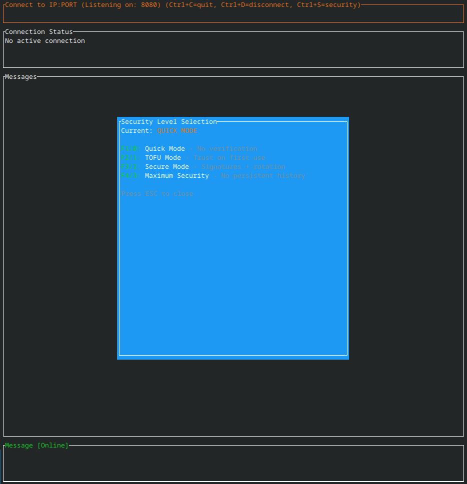

# P2P CLI


A terminal-based peer-to-peer messenger written in Rust. Every application message uses a fresh Noise XX channel (X25519, ChaCha20-Poly1305, BLAKE2s), is signed with a persistent Ed25519 identity, and is checked for replay and protocol-state violations. No relay server is involved; peers must be directly reachable.

> IMPORTANT: This project is under development and is not a stable, released product. It is provided "as-is", without warranty or guarantee. It works to some extent, but may be incomplete, unstable, or contain bugs. Mentions of a version such as "v2" do not imply an official release.





## Features

- **Authenticated Noise Transport** - Fresh forward-secret X25519 + ChaCha20-Poly1305 channel per application message
- **Signed Protocol Transcript** - Ed25519 signatures bind message type, content, timestamp, ID, and metadata
- **TOFU Identity Verification** - Trust on First Use with Ed25519 identity keys
- **Four Security Levels** - From quick messaging to maximum security
- **Persistent Encrypted History** - SQLite storage with AES-256 encryption
- **Modern TUI** - Ratatui-based terminal interface with scrolling and contextual shortcut hints
- **Address Sharing** - Shows your localhost/LAN/public `IP:PORT` so peers can reach you (`/myip`)
- **Chat Commands** - `/help`, `/fingerprint`, `/alias`, and more

## Installation

```bash
# Clone the repository
git clone https://github.com/KyleDerZweite/p2p-cli.git
cd p2p-cli

# Build and run
cargo build --release
./target/release/p2p-cli --help
```

## Usage

```bash
# Start with default settings (port 8080, quick mode)
p2p-cli

# Listen on a specific port
p2p-cli -p 9000

# Start with TOFU security (identity verification)
p2p-cli -s tofu

# Start with maximum security (no persistent history)
p2p-cli -s max

# Combine options
p2p-cli -p 9000 -s secure -v
```

## Connecting Across Networks

The app shows your shareable addresses in the status panel when idle (also via `/myip`). Share the right one with your peer over any other channel (another messenger, phone, etc.), then chat here over the encrypted P2P connection.

- **Same machine:** connect to `127.0.0.1:<port>`.
- **Same LAN:** connect to the other person's LAN address (e.g. `192.168.1.x:8080`). Works out of the box unless a local firewall blocks the port.
- **Over the internet:** connect to the other person's public `IP:PORT`. Because every message opens a new connection to the peer's listener, **both** sides must be reachable — each person needs their listening port forwarded on their router and allowed through their firewall (e.g. `sudo firewall-cmd --add-port=8080/tcp` on Fedora). One reachable side is not enough.
- **Behind CGNAT or without router access:** direct connections won't work. The practical workaround is a mesh VPN like Tailscale or WireGuard on both machines — then connect to the peer's VPN address exactly as on a LAN. Built-in NAT traversal is on the roadmap.

Your public IP is looked up once at startup via api.ipify.org (best effort; the app works fine without it). IP addresses are routing metadata, not secrets — sharing yours with an intended peer is safe, though it does reveal your approximate location to them.

## Security Levels

| Level | Name | Description |
|-------|------|-------------|
| 0 | **Quick** | Encrypted and signed; approve peers for the current session |
| 1 | **TOFU** | Quick plus persistent identity pinning and change rejection |
| 2 | **Secure** | TOFU policy with a fresh forward-secret Noise channel for every protocol message |
| 3 | **Maximum** | Secure transport with in-memory message/trust database and no storage key creation |

All levels have encrypted, integrity-protected transport and signed identities. Levels are policy choices, not choices between plaintext and encryption. Switching to or from Maximum requires restarting because its storage backend is selected before the TUI starts.

## Chat Commands

| Command | Description |
|---------|-------------|
| `/help`, `/h` | Show available commands |
| `/myip`, `/ip` | Show your shareable addresses |
| `/fingerprint`, `/fp` | Show identity fingerprints |
| `/whoami` | Show your identity info |
| `/alias <name>` | Set alias for current peer |
| `/trust` | Permanently trust current peer |
| `/clear` | Clear message history |
| `/disconnect`, `/dc` | Disconnect from peer |
| `/status` | Show connection status |

## Keyboard Shortcuts

| Key | Action |
|-----|--------|
| `Tab` | Switch between Connect/Message fields |
| `Enter` | Connect to peer / Send message |
| `Ctrl+C` | Quit application |
| `Ctrl+D` | Disconnect from peer |
| `Ctrl+S` | Open security level selection |
| `Ctrl+Y` | Copy your shareable address to the clipboard |
| `F1-F4` or `0-3` | Select security level (in the selection popup) |
| `PageUp/Down` | Scroll messages |
| `Ctrl+Home/End` | Scroll to top/bottom |
| `a` | Accept incoming connection |
| `d` | Decline incoming connection |
| `o` | Accept once (don't permanently trust) |

The footer line at the bottom of the TUI always shows the shortcuts relevant to the current context.

## Security Architecture

### Cryptographic layers

1. **Transport**: Noise XX using X25519, ChaCha20-Poly1305, and BLAKE2s. A new ephemeral handshake is performed for every application message.
2. **Application authentication**: Every complete protocol envelope is signed by a persistent Ed25519 identity.
3. **Replay resistance**: UUIDs are cached and timestamps must fall within a five-minute window.
4. **Storage**: Persistent tiers encrypt message bodies with AES-256-GCM and random nonces. Maximum uses SQLite only in memory.
5. **TOFU**: Fingerprints are computed locally from identity keys and pinned keys are rejected if they change.

### TOFU (Trust on First Use)

When running in TOFU mode (`-s tofu`), the app:
1. Generates a permanent Ed25519 identity key pair (stored in the platform-specific config directory, e.g., `~/.config/p2p-cli/p2p_identity` on Linux or `%APPDATA%\\p2p-cli\\p2p_identity` on Windows)
2. Signs the complete application protocol envelope with the identity key
3. Displays peer fingerprints (e.g., `A1B2-C3D4-E5F6-G7H8`)
4. Rejects a known fingerprint whose identity key changes

## Threat model and limitations

The design aims to protect message content and integrity against passive network observers, active network modification, replay, and later compromise of long-term identity keys after ephemeral channel secrets have been erased. TOFU cannot identify an attacker who successfully intercepts the very first contact; compare fingerprints through an independent channel before assigning trust.

It does **not** protect an unlocked or compromised endpoint, terminal capture, malicious dependencies, traffic-analysis metadata (IP addresses, timing, and approximate sizes), denial of service by a sufficiently capable network attacker, or plaintext copied outside the application. Persistent tiers keep peer/trust metadata in SQLite; only message bodies are encrypted. Maximum prevents new persistent chat/trust records but does not erase files created by earlier runs. Secure deletion on SSDs and journaled filesystems cannot be guaranteed by an application.

This project has not received an independent cryptographic audit. “Military grade” is intentionally not claimed: concrete algorithms, state transitions, and limitations are more useful and testable than that label.

## Project Structure

Key crates: **tokio** (async runtime), **ratatui** (TUI), **snow** (Noise), **ed25519-dalek** (signatures), **aes-gcm** (storage encryption), **rusqlite** (history). Source lives in `src/` split into `app/` (logic & config), `crypto/`, `network/`, `ui/`, and `messagedb.rs`.

## Roadmap

- [x] Basic P2P messaging
- [x] Noise XX authenticated transport
- [x] Persistent message history
- [x] Security level framework
- [x] TOFU identity verification
- [x] Chat commands
- [x] Message scrolling
- [x] Fresh ephemeral transport keys for each application message
- [ ] File transfer
- [ ] Multi-peer connections
- [ ] NAT traversal
- [ ] mDNS peer discovery

## License

MIT License - see [LICENSE.md](LICENSE.md) for details.

## Contributing

Contributions are welcome! Please feel free to submit a Pull Request.
