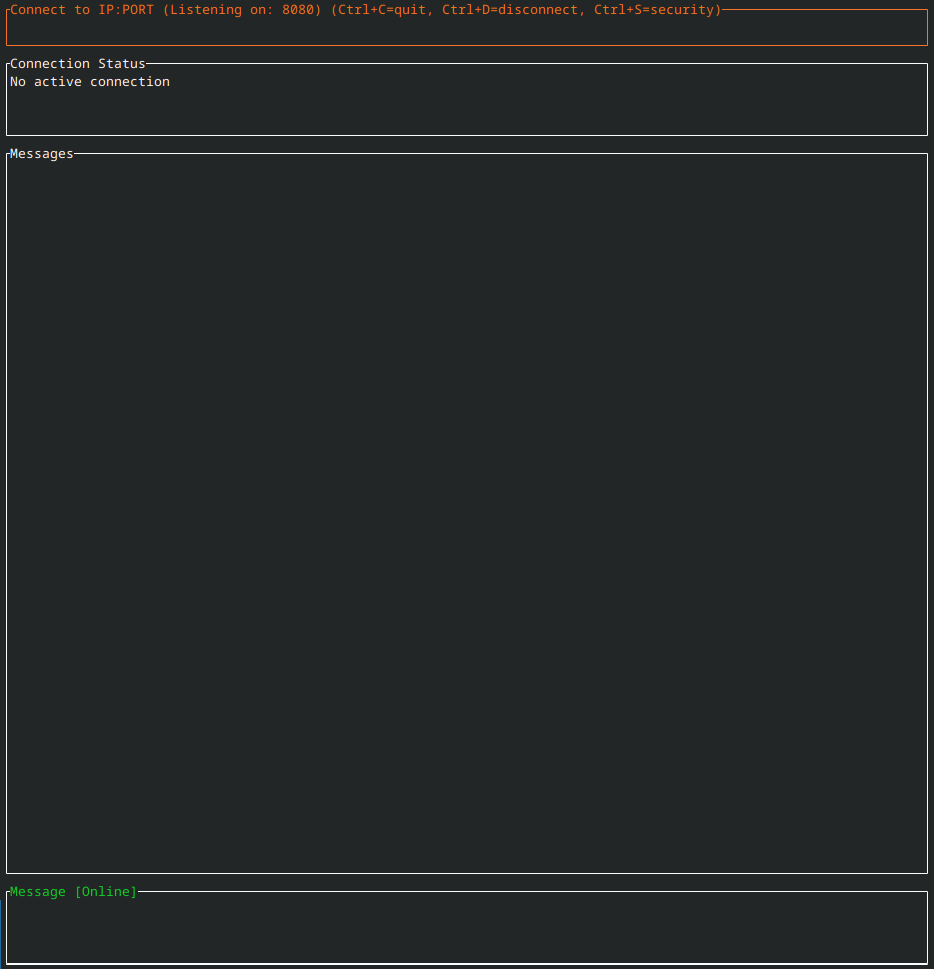

# P2P CLI




A terminal-based peer-to-peer messenger with hybrid encryption and persistent message history.

## Features

- Terminal user interface with real-time messaging
- Hybrid RSA/AES encryption for secure communication
- Persistent message history with SQLite
- Four security levels with automatic negotiation
- Connection timeout handling and graceful disconnection
- Cross-platform support

## Usage

```bash
cargo run [-- <PORT>]
```

**Security Levels:**
- **Quick (0)**: No identity verification
- **TOFU (1)**: Trust on First Use
- **Secure (2)**: Signatures + key rotation
- **Maximum (3)**: No persistent history

**Controls:**
- Tab: Navigate between fields
- Enter: Connect to peer / Send message
- S: Open security level selection
- F1-F4 / 0-3: Select security level
- a/d: Accept/decline connections
- Ctrl+D: Disconnect
- Ctrl+C: Quit

## Build

```bash
cargo build --release
```
